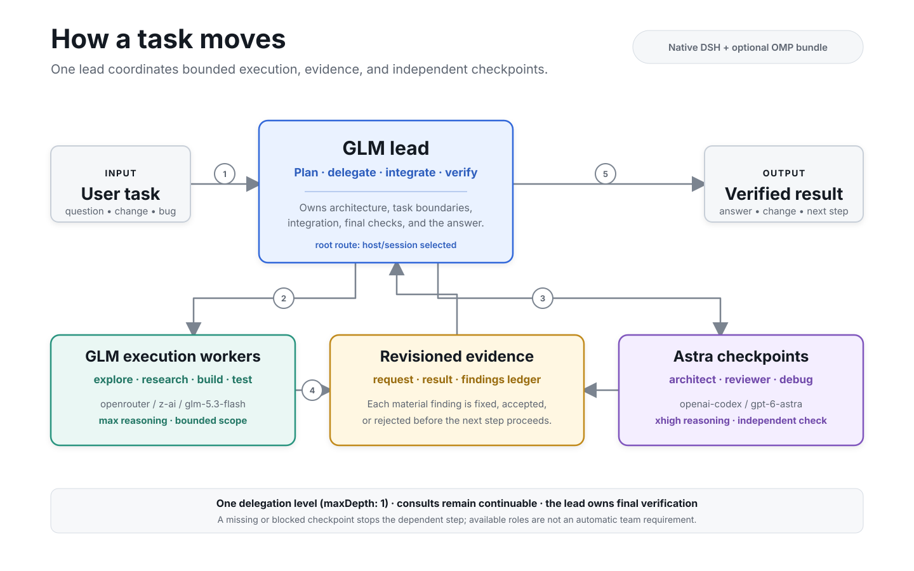

# Astromode · GLM Lead · Astra Checkpoints

<p align="center">
  
</p>

Astromode works with both [DeepSeek Harness (DSH)](https://github.com/deepseek-ai/DeepSeek-Harness) and [Oh My Pi (OMP)](https://github.com/can1357/oh-my-pi). In DSH, GLM 5.3 Flash handles ordinary coding while GPT-6 Astra supplies architecture advice, independent final-diff review, and difficult-debugging consultations. In OMP, the same Astra-led workflow runs globally from any folder, with OpenCode Go GLM 5.3 Flash/max execution agents.

The preset and skill retain the identifier `astra-orchestrator` so existing installations update in place.

## Meet the team

The table below describes the native DSH preset. The separate OMP bundle and its
provider route are documented under [Also for Oh My Pi](#also-for-oh-my-pi).

| Role | Route | Effort |
|---|---|---|
| Root, after explicit activation | `openrouter/z-ai/glm-5.3-flash` | `max` |
| Worker, explorer, tester, researcher | `openrouter/z-ai/glm-5.3-flash` | `max` |
| Architect, reviewer, debug consultant | `openai-codex/gpt-6-astra` | `xhigh` |
| Fork | Inherits the root and its history | Inherited |

GLM works inline by default. Bounded GLM workers are optional when they help; this is not an every-turn delegation or review loop.

## How a task moves



The lead remains the single integrator: workers handle bounded execution, Astra supplies independent checkpoints, and revisioned evidence closes the loop before the result is returned. The same topology is available in the native DSH preset and the optional OMP bundle.

Mandatory instructed checkpoints:

- **Architecture:** call `subagent_architect` before committing to consequential state, persistence, concurrency, or control-routing decisions.
- **Review:** call `subagent_reviewer` on the final actual diff after substantial changes and verification, before claiming completion or deploying. Architecture advice does not replace this review.
- **Debugging:** call `subagent_debug_consult` when a defect survives one meaningful changed-hypothesis retry.

Every consultation follows the same handoff: the root opens with a request header — question, context, revisioned evidence (baseline, scope, diff, verification), constraints, read-first list, and the answer contract with the severity legend — and the consult answers with numbered findings (`F1, F2, …`, severity `blocker | major | minor | note`) before the compact report. The root closes each consultation by dispositioning every material finding: fixed with its validation, accepted with the retained-risk reason, or rejected with counter-evidence. A review covers the evidence revision as handed; material edits after it require a delta review.

The root must obtain the real consultation result before the dependent step. An unavailable required consultation blocks it; a consult reporting `blocked` for missing inputs keeps the checkpoint open until the root supplies them.

**Enforcement boundary:** DSH enforces child route settings, tool filters, and `maxDepth: 1`. Consultation timing is instructed policy, not a runtime deployment lock. The root model remains a host/session selection; choosing the preset alone does not pin it.

## Quick start

Requirements:

- DSH `0.1.5-rc.1`, Node.js 20.10+, and this checkout.
- For the native DSH mode, a configured, working OpenRouter route exposing `z-ai/glm-5.3-flash`, with credentials and balance. Copy installation preserves that route; configure it in DSH first. OpenCode Go routes additionally need `sessionHeader: "x-opencode-session"` on the profile — the OMP bundle patch sets it (see [setup reference](guides/setup-reference.md)).
- ChatGPT/Codex authentication with access to `gpt-6-astra` for consultations.

```bash
node install.mjs --yes --activate --verify
```

This updates the installed preset and skill and explicitly sets fresh-session defaults to **GLM 5.3 Flash / Max**. If Codex sign-in is needed:

```bash
node install.mjs --yes --login
```

Restart DSH when idle, then launch from the workspace you want to use:

```bash
dsh --profile web
```

Create a **new session**, select **GLM Lead · Astra Checkpoints**, and confirm **GLM 5.3 Flash / Max** in the model picker. Existing conversations keep their own model and mounted composition.

### Try your first task

Use a disposable workspace containing a real multi-file bug or feature. Ask for the ordinary outcome without naming subagents. For a consequential persistence change, verify this sequence in the native session journal:

1. GLM investigates the source.
2. `subagent_architect` completes on Astra/xhigh before implementation.
3. GLM implements and exercises the actual program.
4. `subagent_reviewer` completes on Astra/xhigh against the final diff before completion.
5. A routine follow-up stays on GLM without another consultation.

**Do not substitute a headless routing demo:** DSH's headless runner bypasses agent presets. Use the web preset and its native session controller.

## What has been checked?

```bash
npm test
```

The offline suite uses installed DSH libraries and temporary homes. It checks route composition, real scoped tool-registry restrictions, depth, installation, settings preservation, and upgrade/uninstall boundaries. It does not prove model compliance or coding quality.

Live behavior must be checked separately on a real preset-composed session. One successful acceptance run is not evidence of long-session reliability, lower latency, or measured savings. See the [playbook](guides/orchestration-playbook.md#manual-ab-rollout-checks).

## Cost and limits

In the native DSH mode, the root and execution workers use OpenRouter; Astra consultations use the configured ChatGPT/Codex subscription route. Subscription limits still apply. No percentage savings, speedup, or task-quality improvement is claimed without measurement. [Measurement guide](guides/cost-and-performance.md).

## Update or remove

```bash
node install.mjs --yes              # update mode; preserve selected root model/effort
node install.mjs --yes --activate   # also select GLM / max for fresh sessions
node install.mjs --uninstall        # remove mode; restore an owned activation
```

Activation records retain the original model selection and the exact activated route. Uninstall preserves subsequent user model/effort changes; old Astra-led activation records are recognized during upgrade/removal. Settings and replaced presets are backed up.

[Installation, authentication, native boundaries, and limitations](guides/setup-reference.md).

## Also for Oh My Pi

Install the separate OMP bundle once for use from any folder:

```bash
node install-omp.mjs --global
# Then run from whichever project you want to work on:
omp --astromode
```

Use `--project /path/to/project` instead of `--global` for a project-only
install. Back up older project copies before migrating to global. Verify from
this checkout with `node scripts/check-omp.mjs --global --project /path/to/project`.

OMP uses an **Astra/xhigh lead and reviewer, with OpenCode Go GLM Flash/max execution agents**.
The lead reuses consult children through OMP's `hub` tool and keeps a findings
ledger. Startup, live implementation/review, and reviewer revival after a session
resume were verified on OMP 18.1.17. Press `Alt+A` to inspect agents.

Its source, installation, and runtime are independent of this native DSH mode. This DSH migration does not alter an installed OMP project or move an existing conversation. See the [OMP guide](guides/omp-port.md).

## Credits and license

Astra Orchestrator adapts the team structure from
[codex-astra-luna-orchestrator](https://github.com/donvito/codex-astra-luna-orchestrator)
for DeepSeek Harness, with GLM execution, DSH routing, installation, and verification rules.

Original additions use [MIT](LICENSE). Retained upstream material remains under
[Apache 2.0](licenses/Apache-2.0.txt). See [third-party notices](THIRD_PARTY_NOTICES.md)
for attribution and the scope of the provenance review.
