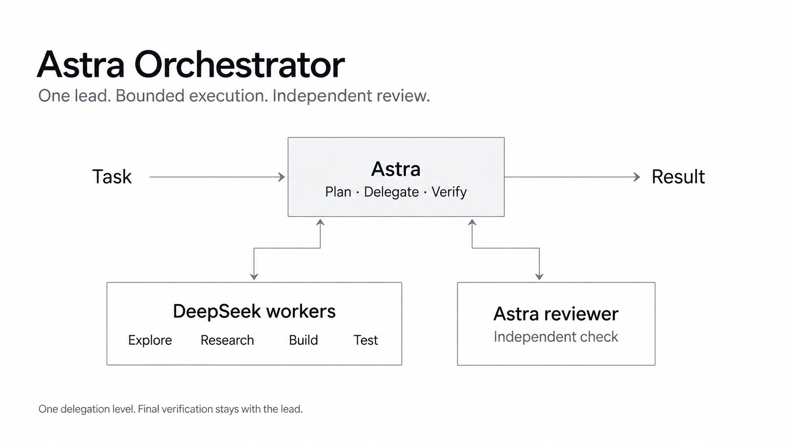

# Astra Orchestrator

**One lead. Focused workers. Independent review.**

An AI coding team for [DeepSeek Harness](https://github.com/deepseek-ai/DeepSeek-Harness).
Give it a task: Astra plans the approach, DeepSeek workers handle focused pieces,
and a separate Astra reviewer checks the changes. The lead brings everything
together and verifies the result.



## Meet the team

| Role | Model | Reasoning | Responsibility |
|---|---|---|---|
| Lead | GPT-6 Astra | **xhigh** | Plan, make architecture decisions, integrate, verify |
| Workers | DeepSeek-V4.1-Flash | **high** | Explore the code, research, implement, test |
| Independent reviewer | GPT-6 Astra | **high** | Check the changes and report problems |

Astra connects through your ChatGPT subscription. Workers use the DeepSeek API.
Everything runs inside DSH. The lead chooses the smallest useful team; a simple
edit can stay with the lead. Workers cannot create more workers through the
preset's delegation tools.

These are the defaults after activation. You can change the lead's model or
reasoning in your session; worker and reviewer routes are fixed by the preset.

## Quick start

You need:

- A working DSH installation. This version targets `@deepseek-ai/dsh` **0.1.5-rc.1**.
- **Node.js 20.10+** and Git.
- A ChatGPT Plus/Pro subscription with Codex access **and Astra available**.
- A DeepSeek API key and available API balance, already configured in DSH.
  The standard route reads `DEEPSEEK_API_KEY`; first confirm a normal DeepSeek
  session works. [Get a DeepSeek API key](https://platform.deepseek.com/).

Clone the project and sign in:

```bash
git clone https://github.com/nadiblu/dsh-mod-astra-orchestrator.git
cd dsh-mod-astra-orchestrator
node install.mjs --yes --login
```

Follow the sign-in link and code printed in your terminal. After sign-in succeeds,
set Astra at **xhigh** as the default for new sessions:

```bash
node install.mjs --yes --activate
```

Restart DSH when it is idle, open a fresh session, and select **Astra Orchestrator**
in the preset picker. Check that the lead shows **GPT-6 Astra / xhigh**.
For the browser interface, run `dsh --profile web` from the project you want to work on.

### Try your first task

```text
Add a search field to this app's item list.
First inspect how the list works, then plan the smallest change.
Use a worker to implement it, test the behavior, and have a separate
reviewer check the diff. Explain the result in plain English.
```

You should see a plan, focused worker activity, a separate review, and a final
explanation of what changed and which checks passed. Each child session shows
its model: DeepSeek for workers, Astra at high for the reviewer.

## Cost estimates

**Illustrative token-cost comparisons, not measured project benchmarks.**

Here is what the same example worker traffic would cost at published API rates.
Input is uncached; output includes reasoning tokens. Amounts are in USD.

| Example worker traffic | Astra API reference | DeepSeek peak | DeepSeek off-peak |
|---|---:|---:|---:|
| 10K input + 2K output | $0.20 | $0.0054 | $0.0027 |
| 50K input + 10K output | $1.00 | $0.0270 | $0.0135 |
| 200K input + 40K output | $4.00 | $0.1080 | $0.0540 |

For this assumed token mix, worker traffic is **97.3% cheaper at peak rates**
than pricing those same tokens on the Astra API. That is a worker-only price
comparison. Different models can consume different token counts on the same task.

**Your actual bill is different:** this mod uses your ChatGPT subscription for
both the lead and reviewer, plus DeepSeek API charges for workers. Offloading
does not reduce the subscription price, and subscription limits still apply.

Rates checked **September 11, 2026**: Astra standard input/output **$10/$50** per
million tokens; DeepSeek peak **$0.30/$1.20**, off-peak **$0.15/$0.60**.
Sources: [OpenAI model pricing](https://developers.openai.com/api/docs/models/gpt-6-astra)
and [DeepSeek pricing](https://api-docs.deepseek.com/quick_start/pricing/).

[See whole-workload estimates, scheduling projections, and assumptions →](guides/cost-and-performance.md)

## What has been checked?

The offline checks cover installation and removal, settings preservation, model
routes, tool restrictions, and delegation depth. Run them with:

```bash
npm test
```

They use installed DSH libraries and a temporary test home. They do not call
models or validate live coding quality. **End-to-end speed, success rate, and
real spending improvements have not been measured for this preset.**
The [evaluation guide](guides/orchestration-playbook.md#manual-ab-rollout-checks)
explains how to collect those results.

## Update or remove

From this checkout:

```bash
git pull
node install.mjs --yes              # update preset and skill; keep your default model
node install.mjs --yes --activate   # also set the lead to Astra / xhigh
```

Restart DSH when idle and start a fresh session after updating. Updating the
preset installs the **high** reviewer setting; `--activate` also replaces your
saved lead model and effort with **Astra / xhigh**.

To remove the mod and restore the saved pre-activation model selection:

```bash
node install.mjs --uninstall
```

[Sign-in help, bundle installation, verification, and known limits →](guides/setup-reference.md)

## Skills and other hosts

The included `astra-orchestrator` skill gives the lead its working rules and is
installed automatically for DSH. The preset supplies the actual models and tools.

**Oh My Pi (OMP): proposed port.** OMP supports skills and named agents, so the
same workflow could be packaged with an adapted skill and agent definitions.
The current package targets DSH; copying its skill alone does not configure OMP.
[Porting notes →](guides/omp-port.md)

## Credits and license

Astra Orchestrator adapts the team structure from
[codex-astra-luna-orchestrator](https://github.com/donvito/codex-astra-luna-orchestrator)
for DeepSeek Harness, with DeepSeek workers, DSH routing, installation, and
verification rules.

Original additions use [MIT](LICENSE). Retained upstream material remains under
[Apache 2.0](licenses/Apache-2.0.txt). See [third-party notices](THIRD_PARTY_NOTICES.md)
for attribution and the scope of the provenance review.
